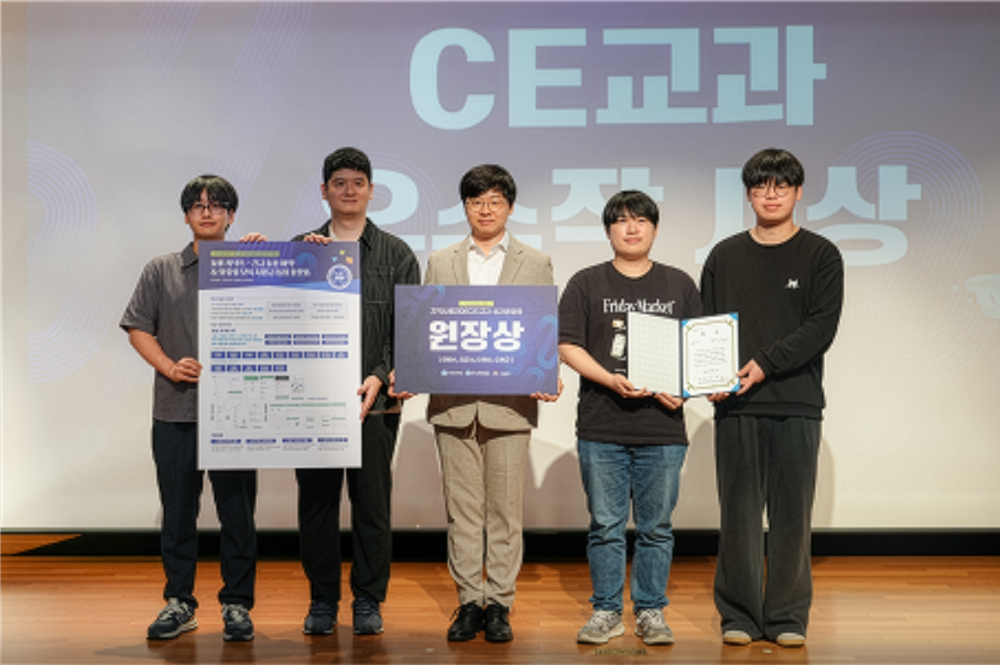

<div align="center">

<!-- 로고 자리: docs/logo.png 를 넣으면 더 멋집니다 -->

# 🤝 돌봄 커넥트 (Care-Connect)

### 시흥시 맞벌이 부부를 위한 긴급 돌봄 예약 & 맞춤형 보육 지원금 통합 플랫폼

<br>


</div>

<br>

---

## 🏆 수상 내역

<div align="center">

# 🥇 2026학년도 1학기 지역사회참여교과(CE) 우수작품 **원장상** 수상

<br>

<!-- 📌 수상 사진을 docs/award.png 로 저장 후 아래 경로가 표시됩니다 -->


<br><br>

> **Team Aokey** · 돌봄 커넥트 (Care-Connect)
> 시흥시 공공 데이터를 활용한 지역 특화 돌봄 플랫폼으로 우수성을 인정받았습니다 🎉

</div>

<br>

---

## 📱 프로젝트 소개

**돌봄 커넥트**는 시흥시의 2026년 신규 보육 정책을 기반으로 개발된 **Android 네이티브 앱**입니다.
맞벌이 부모가 스마트폰 하나로 **아이 돌봄 예약 · 지원금 확인 · 실시간 알림**을 모두 해결할 수 있습니다.

기존 웹 중심의 정책 정보 전달 방식이 맞벌이 부부의 접근성을 저해하는 문제를 해결하기 위해,
**실시간성**과 **개인화** 기술을 결합하여 시흥시민의 정책 체감도를 높였습니다.

| 항목 | 내용 |
|---|---|
| **App ID** | `com.siheung.careconnect` |
| **Min SDK** | 26 (Android 8.0) |
| **Target SDK** | 35 |
| **Language** | Kotlin |
| **Team** | Aokey |

<br>

### 💡 우리가 해결한 문제

| ❌ 기존 문제점 | ✅ 돌봄 커넥트 해결책 |
|---|---|
| 시흥시 돌봄센터 대기자 포화 | 지도 기반 시설 탐색 + 공석 확인 후 즉시 예약 |
| 아이가 아프면 부모가 연차·반차 필수 | 자녀 현황 실시간 확인으로 업무 중 불안감 해소 |
| '아이사랑' 앱은 전국 단위 → 로컬 정보 파악 어려움 | 시흥시 공공 데이터 기반 지역 특화 정보 제공 |
| 돌봄 예약·지원금 정보 분산 | 예약·혜택·알림 원스톱 통합 |
| 실시간 자녀 상태 알림 기능 부재 | FCM 푸시 + PostgreSQL Realtime 즉시 반영 |

<br>

---

## ✨ 주요 기능

| 기능 | 설명 |
|---|---|
| 🔐 **역할별 안전한 로그인** | Supabase Auth(JWT) 기반, 부모·보육원·관리자 권한 분리 |
| 🎁 **맞춤형 지원금 자동 추천** | 자녀 수·소득분위 입력 → 받을 수 있는 시흥시 보육 지원금 카드로 추천 |
| 🗺️ **지도로 근처 시설 찾기** | Google Maps에 시흥시 돌봄 시설 표시 → 가까운 곳 한눈에 확인 |
| 📅 **긴급 돌봄 예약** | 기관 선택 → 날짜·시간 선택 → 예약 확정까지 원스톱 |
| 🔔 **예약·아이 소식 즉시 알림** | 앱을 닫아도 예약 확정·아이 상태 변경 푸시 알림 수신 (FCM) |
| 📡 **선생님 업데이트 실시간 반영** | 보육원 선생님이 올린 사진·메모가 새로고침 없이 즉시 반영 |
| 📋 **예약 내역 한눈에 관리** | 신청한 예약 확인·취소, 보육원은 날짜별 예약 관리 |

<br>

---

## 🎯 기대 효과

<table>
<tr>
<td width="50%" valign="top">

**👨‍👩‍👧 맞벌이 가구 부담 경감**
- 긴급 돌봄 예약 시간 단축 (3분 → 30초 이내)
- 자녀 현황 실시간 확인으로 불안감 해소
- 분산된 돌봄 정보 원스톱 통합

</td>
<td width="50%" valign="top">

**💰 보육 지원금 활용률 향상**
- 시흥시 보육 정책 개인 맞춤형 큐레이션
- 미신청 복지 수혜 증가
- 소득분위별 최적화 혜택 즉시 안내

</td>
</tr>
<tr>
<td width="50%" valign="top">

**🏫 보육 시설 운영 효율화**
- 스케줄·예약 디지털화로 행정 부담 감소
- 보호자–보육원 실시간 소통 채널 확보
- 공석 자동 관리로 정원 활용률 극대화

</td>
<td width="50%" valign="top">

**🌆 시흥시 스마트시티 기여**
- 공공 데이터 활용 지역 특화 서비스 모범 사례
- 보육 정책 체감도 향상
- 타 자치구 확산 모델로 발전 가능

</td>
</tr>
</table>

<br>

---

## 🛠️ 기술 스택

| 분류 | 기술 | 용도 |
|---|---|---|
| **언어** | Kotlin | Android Native 개발 |
| **백엔드** | Supabase (BaaS) | Auth · DB · Storage · Realtime |
| **DB** | Cloud PostgreSQL (Supabase) | 예약·정책·시설 데이터 통합 저장 |
| **실시간** | PostgreSQL Realtime (WebSocket) | DB 변화 감지 → 즉시 UI 반영 |
| **지도** | Google Maps SDK 18.2.0 + Maps Utils 3.8.2 | 시설 위치 시각화, 마커 클러스터링 |
| **위치** | Google Location Services 21.1.0 | 현재 위치 기반 거리 계산 |
| **알림** | FCM (Firebase Cloud Messaging) | 백그라운드 푸시 알림 |
| **보안** | Supabase RLS | DB 레벨 사용자 데이터 접근 제어 |
| **네트워크** | Ktor Android Client | Supabase SDK 내부 HTTP 처리 |
| **UI** | Material Components 1.10.0 | 컴포넌트 및 테마 |

<br>

---

## 🏗️ 아키텍처

Activity 기반 아키텍처를 채택하며, 각 화면은 독립적인 Activity로 구성됩니다.

```
app/src/main/java/com/siheung/careconnect/
├── login/          # LoginActivity, SignUpActivity, SupabaseClientProvider
├── main/           # MainActivity (홈 — 네비게이션 드로어, 공지 캐러셀, 메뉴 카드)
├── benefits/       # BenefitsActivity, BenefitAdapter, BenefitItem (필터링 혜택 목록)
└── reservation/    # ReservationActivity, FacilityAdapter, ChildcareFacility (Google Maps + 클러스터링)
```

**사용 UI 패턴**
- View Binding (전역 활성화)
- BottomSheetDialogFragment — 시설·혜택 상세 뷰
- RecyclerView + 커스텀 어댑터 — 리스트 화면
- Material Chips — 카테고리 필터

<br>

### 🗄️ 데이터베이스 스키마

Supabase PostgreSQL 기반이며, 5개 테이블로 구성됩니다.

```
users          — 사용자 계정 및 역할 (보호자 / 보육원관리자 / 시스템관리자)
children       — 아이 정보 (parent_id → users)
reservations   — 예약 내역 (parent_id, facility_id, child_id)
facilities     — 보육 시설 정보 (좌표, 정원, 담당 관리자)
policies       — 보육 지원금·정책 (맞춤 추천 조건식 포함)
```

모든 테이블에 **RLS(Row Level Security)** 정책이 적용되어, 사용자는 자신의 데이터에만 접근할 수 있습니다.

<br>

### 👤 사용자 역할

| 역할 | 접근 범위 |
|---|---|
| **보호자** | 로그인·회원가입, 맞춤형 혜택, 예약 신청·현황, 실시간 아이 정보, 마이페이지 |
| **보육원 관리자** | 예약 현황 조회·상태 변경, 스케줄 등록·수정, 보호자 알림 전송 |
| **시스템 관리자** | 전체 회원 조회, 역할 부여·변경 |

<br>

---

## ⚙️ 시작하기

### 사전 요구사항

- Android Studio (최신 안정 버전 권장)
- JDK 17 이상
- 실제 디바이스 또는 Android 에뮬레이터 (API 26+)
- Google Maps API Key
- Supabase 프로젝트 (URL 및 anon key)

### 설치 및 빌드

**1. 저장소 클론**

```bash
git clone https://github.com/hyungunoh321/DolBom-Connect-Project.git
cd DolBom-Connect-Project
```

**2. Google Maps API Key 설정**

프로젝트 루트의 `local.properties` 파일에 아래 내용을 추가합니다.
이 파일은 `.gitignore`에 포함되어 있으므로 절대 커밋하지 마세요.

```properties
GOOGLE_MAPS_API_KEY=your_google_maps_api_key_here
```

**3. Supabase 설정 확인**

`login/SupabaseClientProvider.kt` 파일에 Supabase URL과 anon key가 설정되어 있는지 확인합니다.

**4. 빌드 및 실행**

```bash
./gradlew assembleDebug    # 디버그 빌드
./gradlew installDebug     # 연결된 디바이스에 설치
./gradlew assembleRelease  # 릴리즈 빌드
```

<br>

---

## 👥 팀 소개 — Team Aokey

<div align="center">

<table>
  <tr>
    <td align="center" width="25%">
      <br/>
      <b>오현근</b><br/>
      <a href="https://github.com/hyungunoh321">@hyungunoh321</a><br/>
      <sub>팀장 · FE (지도·예약)</sub>
    </td>
    <td align="center" width="25%">
      <br/>
      <b>안현빈</b><br/>
      <a href="https://github.com/안현빈_GITHUB_ID">@안현빈_GITHUB_ID</a><br/>
      <sub>FE (혜택·관리자)</sub>
    </td>
    <td align="center" width="25%">
      <br/>
      <b>김준서</b><br/>
      <a href="https://github.com/김준서_GITHUB_ID">@김준서_GITHUB_ID</a><br/>
      <sub>BE · 인프라 · 실시간</sub>
    </td>
    <td align="center" width="25%">
      <br/>
      <b>김병수</b><br/>
      <a href="https://github.com/김병수_GITHUB_ID">@김병수_GITHUB_ID</a><br/>
      <sub>FE (인증·관리자)</sub>
    </td>
  </tr>
</table>

</div>

| 팀원 | 역할 | 주요 담당 |
|---|---|---|
| **오현근** (팀장) | 프론트엔드 (지도·예약), 프로젝트 관리 | Google Maps SDK 연동, 예약 신청, 예약 현황 확인 |
| **안현빈** | 프론트엔드 (혜택·관리) | 맞춤형 혜택 조회, 시스템 관리자 기능(권한·회원 관리), 마이페이지 |
| **김준서** | 백엔드·인프라·실시간 통신 | Supabase 환경 세팅·DB 스키마, FCM 푸시 알림, PostgreSQL Realtime, 비기능 최적화 |
| **김병수** | 프론트엔드 (인증·관리자) | 로그인, 회원가입, 보육원 관리자 스케줄 등록·수정, 관리자 예약 현황 조회 |

> 💡 팀명 **Aokey**는 팀원 성(姓) 이니셜을 조합하여, 긍정적인 메시지를 담았습니다.

<br>

---

<div align="center">

**돌봄 커넥트 · Team Aokey · 2026**

🏆 *2026학년도 1학기 지역사회참여교과(CE) 우수작품 원장상 수상작*

</div>
